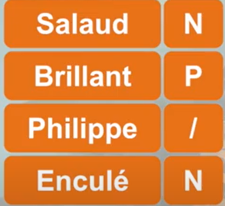
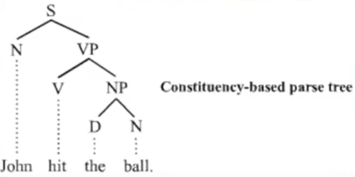
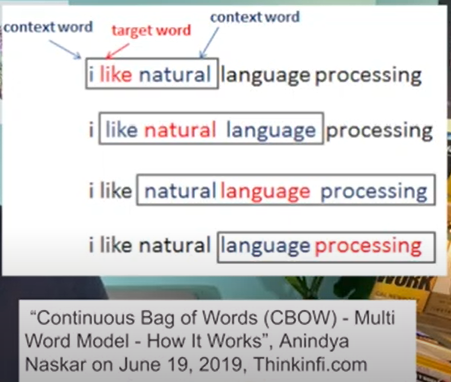
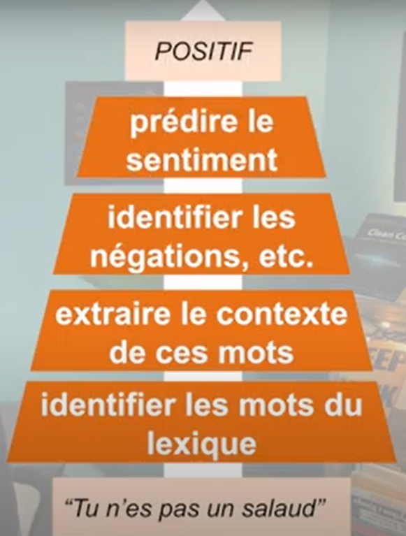

# Analyse des sentiments
L’analyse du sentiment est extrêmement utile en veille des medias sociaux car elle permet d’obtenir une vue d’ensemble sur l’opinion du public au sujet de certains thèmes. Les outils de veille tel que Brandwatch Analytics, rendent ce processus plus rapide et plus facile que jamais auparavant grâce à leurs capacités d’analyse en temps réel.

## C'est quoi l'analyse des sentiments
c'est utilisé les algorithmes de machine learning pour savoir si ce que les gens disent est négative ou négative,
ça fonctionne pour les textes, les audios et les vidéos.
## Les raisons pour le succès d'une technologie:
* la première raison c'est lorsqu'elle drole ou fun, impréssionnant, par deepfake
* la deuxième raison c'est lorsqu'une technologie rapport de l'argent même si elle respecte pas les règles précedente
   c'est cas l'analyse des sentiments

## A quoi sert l'analyse des sentiments ?
Imaginer qu'une société lance une application dont le rôle est de permettre aux gens de vendre en ligne, mais quelques mois
on constate que peu de gens ont télécharger l'application et le peu qui a téléchargeé n'utilise pres que pas. 
Alors la société veut lancer une campagne de marketing mais avant de lancer la campagne elle veut être sûr d'envoyer le
bon message à la bonne personne c'est qu'elle fait appelle l'aide de l'analyse des sentiments en partant sur  les différents 
réseaux sociaux pour recueillir les commentaires, messages, postes la concernant et ensuite elle va pouvoir isoler les sentiments
positifs à ceux négatifs et du coups elle pouvoir ce que les gens aiment ou detestent sur leur produit(prix, ergonomie, qualité du service, ...)
en croisant ces informations avec les données personnelles elle va pouvoir identifier utilisateurs qui aiment leur produit ou qui ne l'aiment pas
par exemples est ce que ce sont: 
* les hommes, femmes
* où ils vivent ( à la campagne, dans les ville)
* tranche d'âge
* quels sont leur sujet d'intérêt ( de quoi parlent-ils)
Bref l'analyse des sentiments peut permettre à une société ou entité d'économiser beaucoups d'argent.

## Application de l'analyse de sentiments
* analyse de marché des concurent
* améliorer les contact centers
* monitoring des réseaux sociaux

## Comment ça merche 

Dans l'analyse des sentiments, il y a trois (3) approches
1. RULE BASED
2. MACHINE LEARNING
3. DEEP LEARNING
Alors ici, nous allons expliquer l'approche **RULE BASED** 
## L'approche RULE BASED
comment ça fonctionne l'approche **RULE BASED**, elle repose sur deux principes: un lexique et des règles.

## La lexique
la lexique est une longue liste de deux colonnes, à gauche les mots et à droite les sentiments des mots.
 
avec une liste comme ça, nous allons trois règles à savoir
* <code>**N**</code> Négative
* <code>**P**</code> Positive
* <code>**/**</code> Neutre

## Les règles
Les règle en résumé, c'est le gargon, par opposition au **machine learning** c'est pour dire que la marchine n'a rien appris qu'on lui à dit tout ce
qu'elle devait faire.
La règle la plus simple serait de compter le nombre de mot positif et le nombre de mot négatif dans une phrase.

si le nombre de mot positif est supérieur au nombre de mot négatif, alors on considère que la phrase est positive.

## Exemple

Pour qu'un modèle puis comprendre le sentiment d'une phrase, il doit aussi pouvoir comprendre la syntaxe, on doit écrire des règles
plus strictes et ça il y a des sujets de recherche.
* [Analysis of Hindis reviews](https://aclanthology.org/W13-4306.pdf)
* [A SURVEY ON SENTIMENT ANALYSIS METHODS AND APPROACH](https://ieeexplore.ieee.org/stamp/stamp.jsp?tp=&arnumber=7951748) 
 
Dans la plupart des cas, les règles qu'on utilise pour comprendre la syntaxe des phrases utilisent ce qu'on appelle le 
**contexte des mots**  

## Résumé

